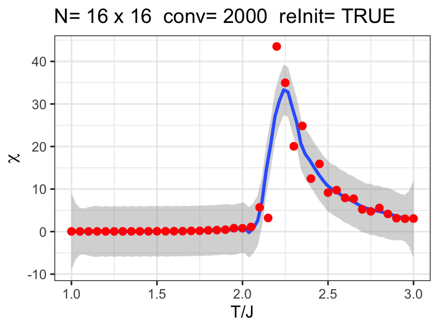
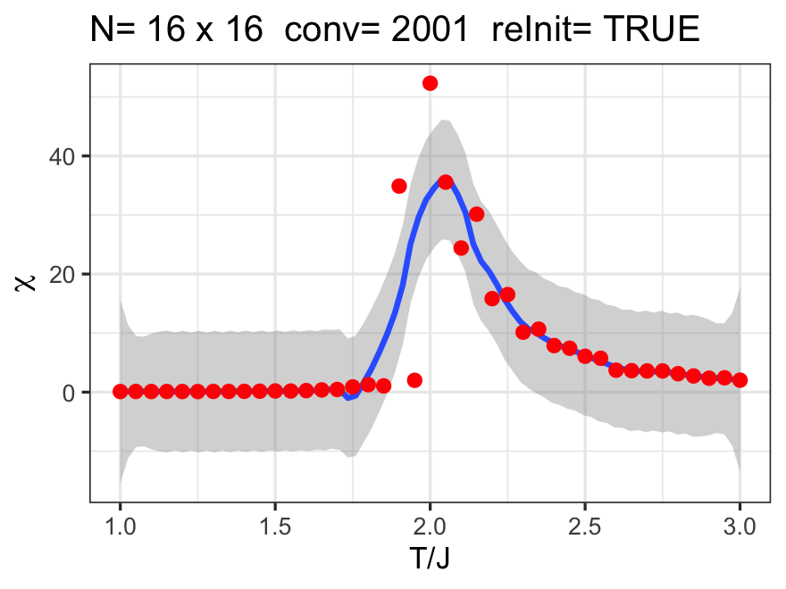

# Ising 2D with Defects

In the diluted Ising 2D model, defects are introduced by including a *J matrix* shown in the code for `Ising2D-Defects.R`. The dilution is achieved with

```R
J.matrix =  matrix(data=J, nrow=N, ncol=N)
x = runif(N.defects,1,N*N)
J.matrix[x]=0
```

Using 0.1 million burn-in steps, here is the result for **4% dilution** with paramagnetic spins:



Here is the result for **10% dilution** with paramagnetic spins:

