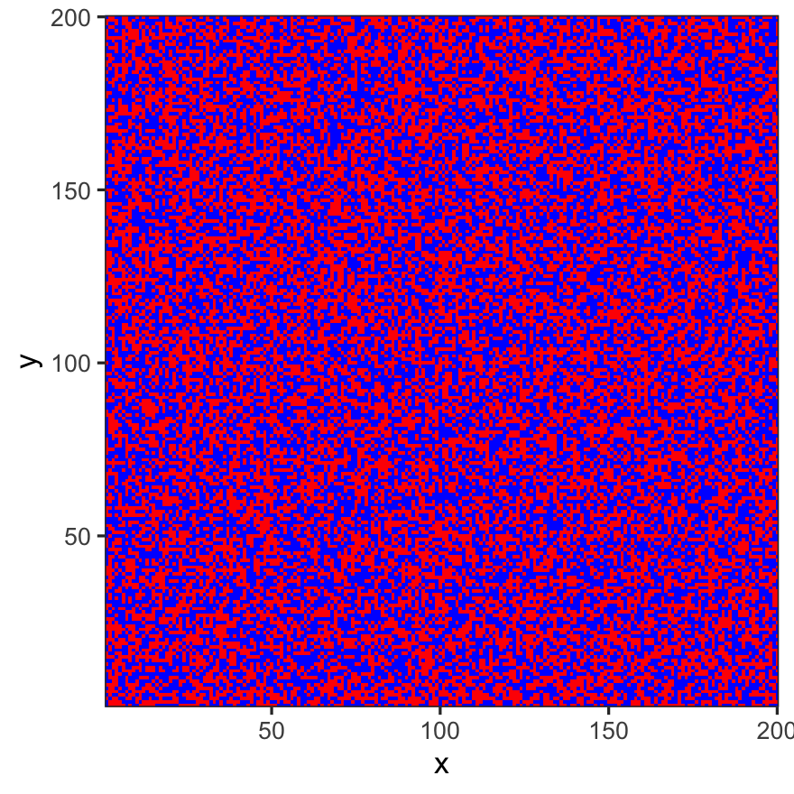
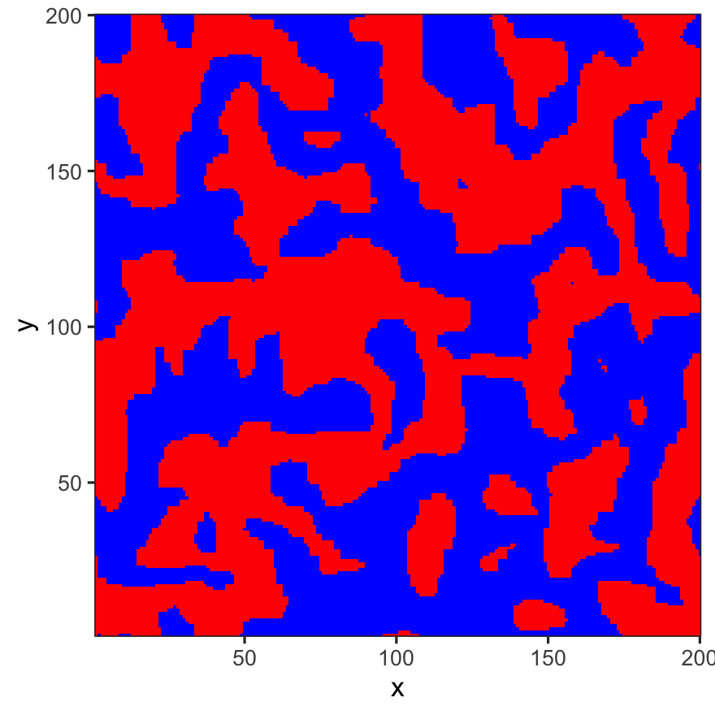
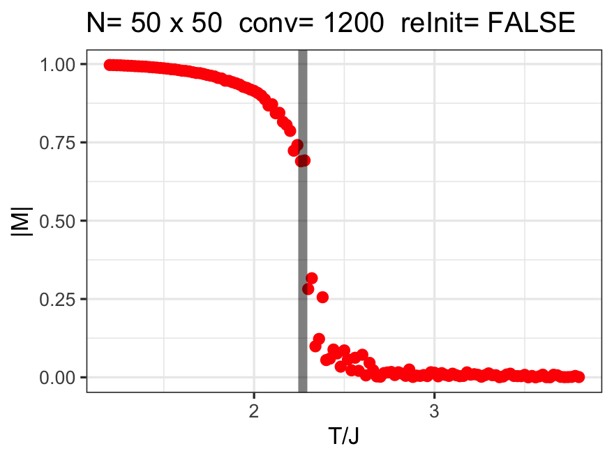
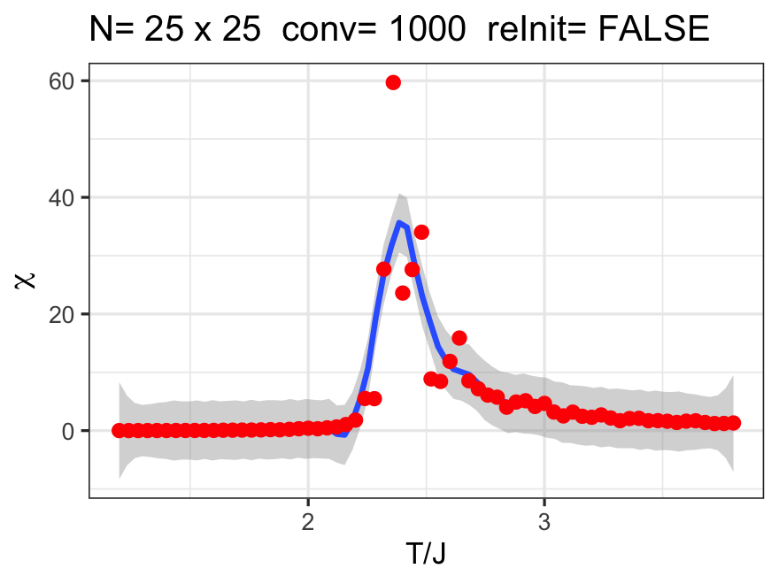
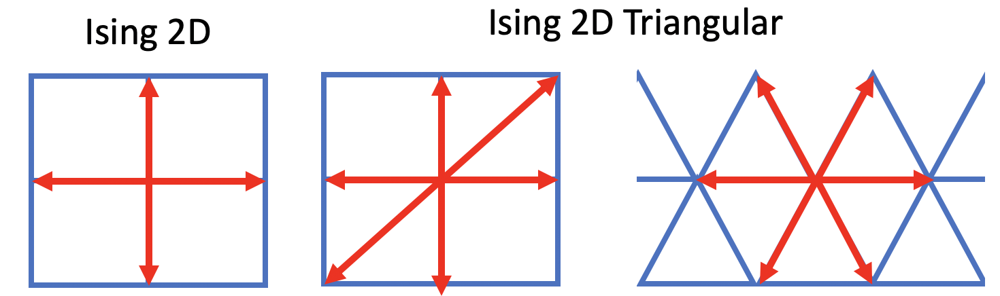
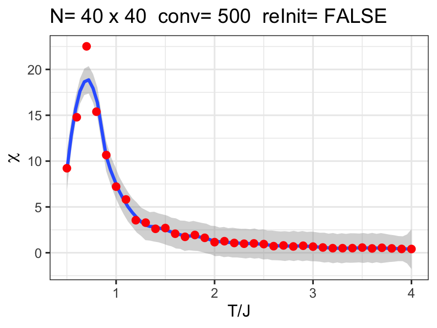

# MonteCarlo-Ising2D
 Monte Carlo simulation of Ising 2D model in R, here is the essential code, where `spin` is the matrix with +1 and -1 values:

 ```R
 for(i in 1:num.iter) {
   x=round(runif(1,min=1,max=N))
   y=round(runif(1,min=1,max=N))
   nb = spin[(x %% N)+1,y] + spin[((x-2) %% N)+1,y] +
     spin[x,(y %% N)+1] + spin[x,((y-2) %% N)+1]
   dE = 2*J*spin[x,y]*nb
   if (dE<0) {
     spin[x,y] <<- -spin[x,y]
   } else {
     if (runif(1) < exp(-dE*beta)) {
       spin[x,y] <<-  -spin[x,y]
     }
   }
 }
 ```


## Ising 2D Model

The Ising2D model is initialized as follows:



After a bit of Monte Carlo, a domain pattern emerges at low enough temperatures:




Repeating this procedure over a range of temperatures and waiting for convergence, one finds the phase transition where domains can form:



The susceptibility was also computed, it is found at `T/J = 2.36`; the critical temperature is at [T/J = 2.27](https://en.wikipedia.org/wiki/Square-lattice_Ising_model).




## Ising 2D Triangular Lattice

We are considering 3 next nearest neighbours instead of 4. We are choosing the following schema:




## Optimization

To improve the speed, we can generate the random numbers for all iterations at once, see `computeIsingRand()`. This more than doubles the speed as compared to brute-force `computeIsing()`. In the test, 878ms become 385ms for the computation.

Eliminating the exp function does not improve speed at all, see `computeIsingRandExp()`. The R compiler must have a pretty fast method to retrieve the exponentials already.

## Ising 1D

Adding Monte Carlo computation for 1D case, randomly chose x-axis. The results show no phase transition as expected:


