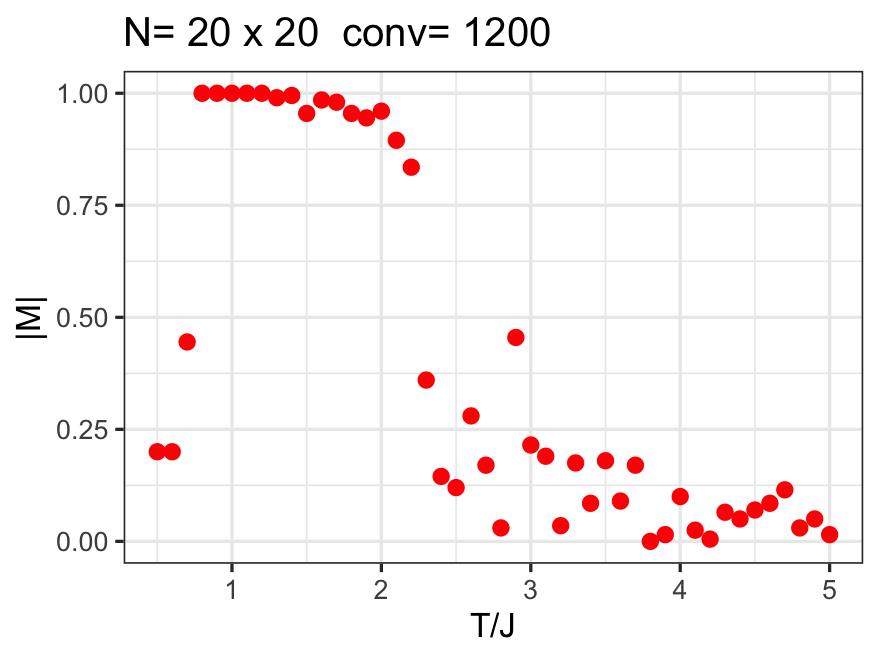

# MonteCarlo-Ising2D
 Monte Carlo simulation of Ising 2D model in R
 

## Ising 2D Model

The Ising2D model is initialized as follows:

After a bit of Monte Carlo, a domain pattern emerges at low enough temperatures:

Repeating this procedure over a range of temperatures and waiting for convergence, one finds the phase transition where domains can form:

## Optimization

To improve the speed, we can generate the random numbers for all iterations at once, see `computeIsingRand()`. This more than doubles the speed as compared to brute-force `computeIsing()`. In the test, 878ms become 385ms for the computation.

Eliminating the exp function does not improve speed at all, see `computeIsingRandExp()`. The R compiler must have a pretty fast method to retrieve the exponentials already.